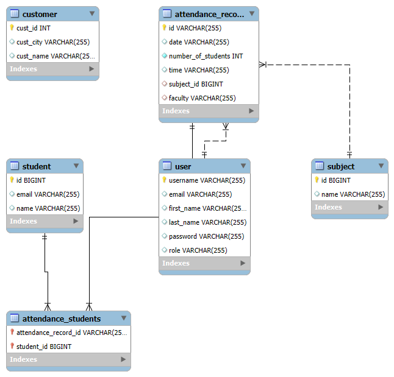
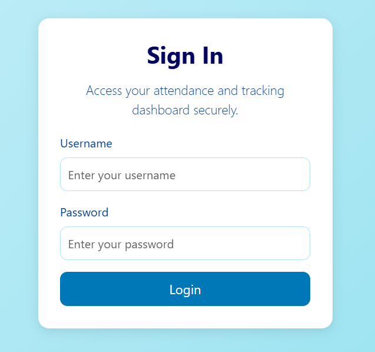
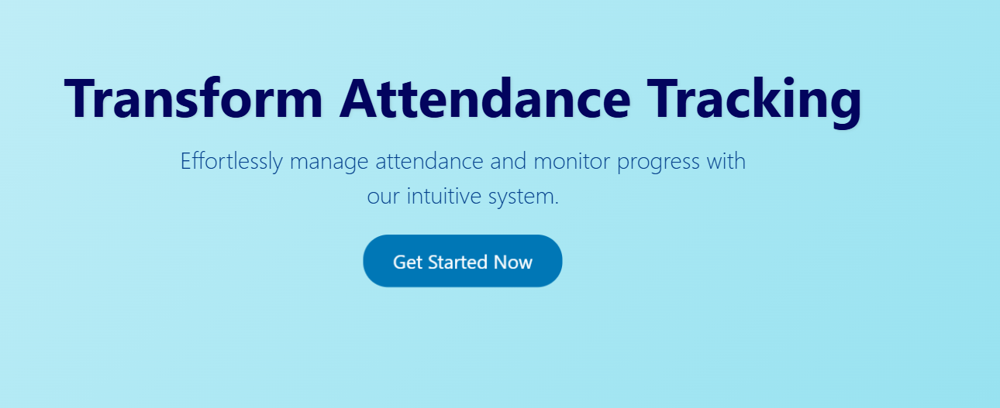
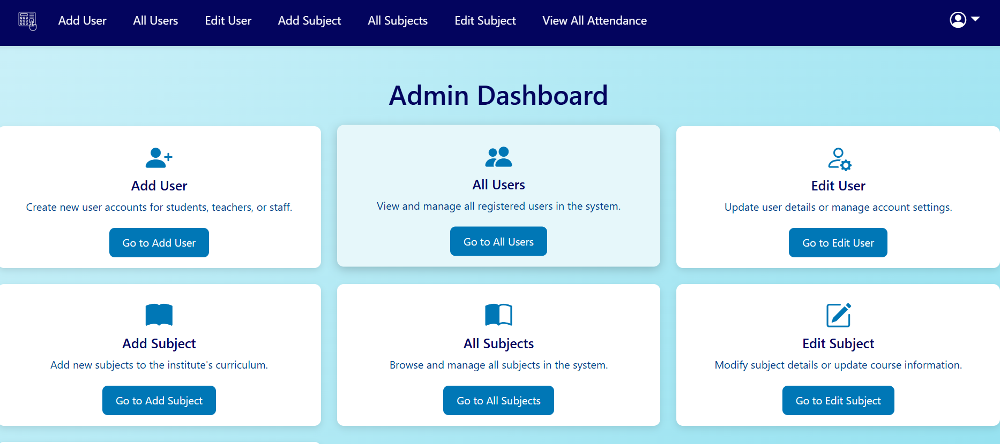
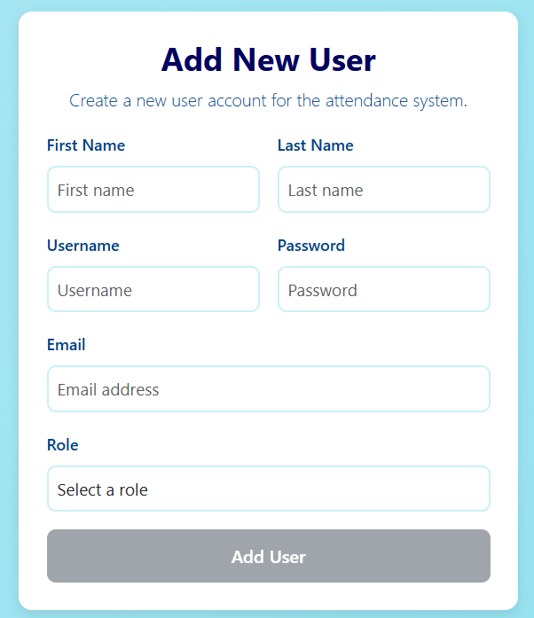
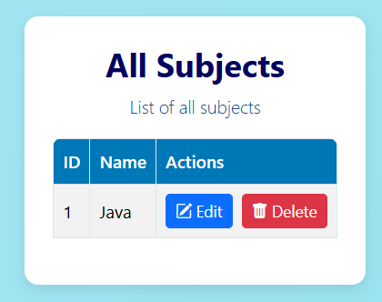

# 📊 SamTrack

**SamTrack** is a full-stack web application developed during my training at *The Kiran Academy*. It streamlines student attendance tracking with role-based access, subject mapping, and session-wise analytics.

---

## 🚀 Key Features

- 🔐 Role-based Login (Admin, Faculty)
- 🧑‍🎓 Student Management with Attendance
- 📚 Subject-wise Session Logging
- 🏫 Customer (Institution) Level Management
- 📊 Dashboard View for Attendance Insights

---

## 🛠 Tech Stack

| Layer      | Technology                       |
|------------|----------------------------------|
| Frontend   | Angular 17+, TypeScript, HTML/CSS |
| Backend    | Spring Boot (Java 17), REST APIs |
| Database   | MySQL                            |
| Tools      | Git, Maven, Postman              |

---

## 📁 Project Structure

```
SamTrack/
├── frontend-angular/         # Angular SPA
├── backend-springboot/       # Spring Boot backend
├── database/                 # schema.sql and ER diagram
│   └── er-diagram.png
├── docs/
│   └── screenshots/
│       ├── sign-in.png
│       ├── home-page.png
│       ├── admin-dashboard.png
│       ├── add-user.png
│       └── all-subject.png
├── .gitignore
└── README.md
```

---

## 🧩 ER Diagram



---

## 🖼️ UI Screenshots

| View | Screenshot |
|------|------------|
| 🔐 Login |  |
| 🏠 Home |  |
| 🧑‍💼 Admin Dashboard |  |
| ➕ Add User |  |
| 📚 Subject List |  |

---

## 🧱 Database Setup

```sql
CREATE DATABASE samtrack;
-- Import schema.sql file from /database/
```

---

## 🧪 Running the Application

### 🔧 Prerequisites

- Java 17+
- Maven
- Node.js 16+
- Angular CLI
- MySQL Server

---

### 🖥 Backend (Spring Boot)

```bash
cd backend-springboot
./mvnw spring-boot:run
```
> Make sure to update `application.properties` with your MySQL credentials.

---

### 🌐 Frontend (Angular)

```bash
cd frontend-angular
npm install
ng serve
```
> App will run at: `http://localhost:4200`

---

## 🧠 Note

📍 Built as part of my hands-on training to master full-stack Java development. This project strengthened my practical skills in Spring Boot, Angular, and MySQL.

---

## 🤝 Connect With Me

- 🔗 [LinkedIn](https://www.linkedin.com/in/rohit-salve-6054b324a/)
- 💻 [GitHub](https://github.com/RohitSalv)
- 📧 salver814@gmail.com
